<!--
%\VignetteEngine{knitr::knitr}
%\VignetteIndexEntry{Introduction to the ggBrain Package}
-->


# Introduction to the ggBrain Package


## Introduction 

The *ggBrain* package converts 3-D or 4-D brain image arrays to "long" data frames, which are then converted in *ggplot* objects. Users can create multi-panel figures showing several slices from  several brains. Within each panel, either structural images can be displayed, or voxelwise statistics (i.e. seed correlations or p-values) can be displayed on top of a template.

The `ggBrain` function is the flagship function of this package, and requires minimal input from the user. This function generates *ggplot* objects for displaying brain images. For further customization of brain image figures, the `getBrainFrame` function can be used to generate long data frames from 3-D or 4-D brain image arrays. These data frames include variables that can be used for faceting images in multi-panel displays. Within the *ggBrain* package, the `ggBrain` function makes several calls to `getFrameBrain`.

The package also includes several aesthetic features, such as:
* A special option for "<a href='#tri-planar'>tri-planar</a>" figures:  For a given voxel, a tri-planar figure shows the sagittal, coronal, and transverse slices that intersect that voxel. These three slices are shown in three panels, and cross-hairs are generated to show the spacial correspondence between the slices.
* Separete fill scales for template images and for overlaying voxelwise statistics: The *ggplot2* package generally discourages the use of color to display different types of data, on different scales. This poses a challange for brain image figures where we want to use color to display tissue intensity of a template brain image, and also use color to show the value of a voxel-wise statistic (such as seed correlation) overlaid on top of the template. The template tissue intensities and the test statistic values are on different scales, which goes against *ggplot*'s method of mapping only one scale to color. `ggBrain` implements the quick fix of hardcoding the coloring of the template image.
* Combined legends that incorportate both alpha blending and fill.
* *ggplot* themes, for changing the background to be black, and for removing irrelevant plot labels. 

The remainder of this vignette provides example code for <a href='#single-panel'>basic image figures</a> with just one slice, for <a href='#multi-panel'>multi-panel</a> figures, and for <a href='#tri-planar'>tri-planar</a> figures.


##  <a name="single-panel"> Single-panel figures</a>

Before beginning our basic examples, we'll load brain images for use in the remainder of this vignette. 


```r
# Loading data for use in all examples

library(oro.nifti) #for opening nii.gz files

s_map1<-readNIfTI(system.file('seed_corr_1.nii.gz', package='ggBrain'))
s_map2<-readNIfTI(system.file('seed_corr_2.nii.gz', package='ggBrain'))
template <- readNIfTI(system.file('template.nii.gz', package='ggBrain'))
mask <- readNIfTI(system.file('brain_mask.nii.gz', package='ggBrain'))
seed_mask <- readNIfTI(system.file('seed_mask.nii.gz', package='ggBrain'))
nii1_trunc <- readNIfTI(system.file('subj_trunc_1.nii.gz', package='ggBrain'))


# get high definition brain image from the brainR package
if(require(brainR)){
  hd_template <- readNIfTI(system.file("MNI152_T1_1mm_brain.nii.gz", package="brainR"))
}

library(ggBrain) 
library(ggplot2) 
```

To create a single-slice plot of a structural brain image (i.e. MRI, as opposed to fMRI), set the `type` argument of `ggBrain` to `'structural'`.


```r
dd<-ggBrain(brains=hd_template,mask=hd_template>0,mar=3,mar_ind=93,type='structural')
#now add aethetic changes with conventional ggplot code.
dd + scale_fill_continuous(low="black", high="white") + theme_black_bg()
```

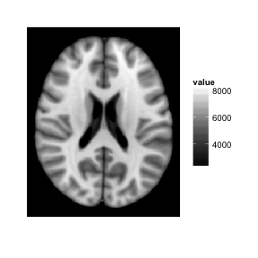 

Above, the `mar=3` argument tells that the transverse plane should be used, as opposed to the sagittal or coronal planes. The `mar_ind` argument tells the slice number to plot.

Voxelwise statistics can also be plotted on top of a template image. If the voxelwise statistic can be both positive and negative (i.e. seed correlation images), users should set `type=signed`. `ggBrain` uses color to denote the sign of the voxelwise statistic, and alpha blending to denote the absolute value of the statistic. By default, `ggBrain` combines these two aesthetic dimensions (color and alpha blending) into a single legend. This is achieved by binning the values of the voxelwise statistic. The legend shows the upper boundaries of these bins.


```r
# s_map1 is a seed correlation image, based on correlation with the region denoted by seed_mask
dd<-ggBrain(template=template,brains=s_map1,mask=mask,mar=3,mar_ind=30,type='signed')

dd + theme_black_bg()
```

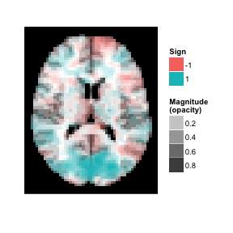 

For voxelwise statistics are all positive (i.e., p-values), the `type` argument should be set to `'positive'`. As an example here we simply take the absolute value of the seed correlation image, but a p-value map could also be displayed.


```r
dd<-ggBrain(template=template,brains=abs(s_map1),mask=mask,mar=3,mar_ind=30,type='positive')

dd + scale_alpha(range=c(0,1)) + theme_black_bg()
```

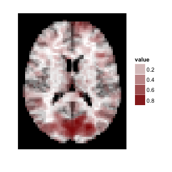 

If no template is specified, values are plotted against a pure white version of the mask.


```r
dd<-ggBrain(brains=abs(s_map1),mask=mask,mar=3,mar_ind=30,type='positive')

dd + scale_alpha(range=c(0,1)) + theme_black_bg()
```

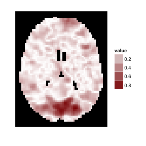 


For users more familiar with *ggplot*, the `getBrainFrame` function can be used to generate a data frames for use in *ggplot* objects. This can allows more control over plotting choices, but also requires more input from the user.


```r
bf<-getBrainFrame(brains=hd_template,mar=3,mar_ind=93,mask=hd_template>0,center_coords=FALSE)
head(bf)
```

```
##   value row col row_ind col_ind
## 1  3409  97  26       1       1
## 2  3877  98  26       1       1
## 3  4258  99  26       1       1
## 4  4530 100  26       1       1
## 5  4710 101  26       1       1
## 6  4782 102  26       1       1
```

```r
ggplot()+geom_tile(data=bf, aes(x=row,y=col,fill=value))+facet_grid(row_ind~col_ind)+coord_fixed(ratio = 1)
```

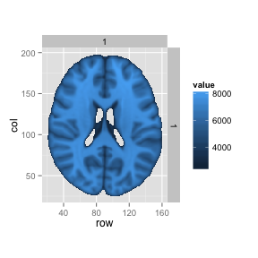 


## <a name="multi-panel"> Multi-panel brain figures</a>

For multi-panel images, either `ggBrain` or `getBrainFrame` require the input of several vectors: `mar`, `mar_ind`, `col_ind`, `row_ind`. All of these vectors should be of the same length. This length will be equal to the number of panels in the final figure. 

For each panel, `mar` denotes which margin of the brain image we should slice over, `mar_ind` denotes the slice number, and `row_ind` and `col_ind` denote the position of the panel within the overall figure. This layout convention allows for several types of images to be constructed, such as <a href='#tri-planar'>tri-planar</a> figures and comparisons of images from different subjects.

As a basic example, suppose we wish to show four transverse slices from a single subject's brain image.


```r
mar_ind<-floor(seq(140,90,length=4))

dd<-ggBrain(hd_template, mask=hd_template>0,
  mar= c(3,3,3,3),
	mar_ind=mar_ind,
	col_ind=c(1,1,1,1),
	row_ind=factor(c(1,2,3,4),labels=paste('Slice',mar_ind)),
	type='structural')

dd + theme_black_bg() 
```

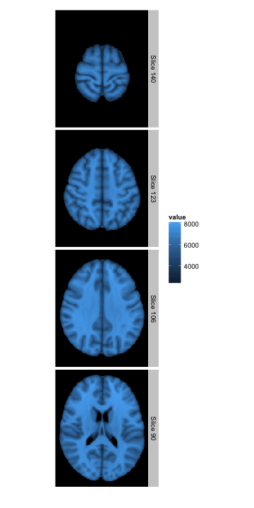 

Above, setting the values of `row_ind` to the vector `c(1,2,3,4)` causes the images to be aligned vertically.

Alternatively, we can use the `time` argument to plot different images taken during the course of an fMRI


```r
dd<-ggBrain(brains=nii1_trunc,template=template,
  mask=mask,
	mar=rep(3,4),
	mar_ind=rep(30,4),
	row_ind=rep(1,4),
	col_ind=paste('Time',1:4),
	time=1:4)

dd + theme_black_bg() + labs(title='Sample fMRI data')
```

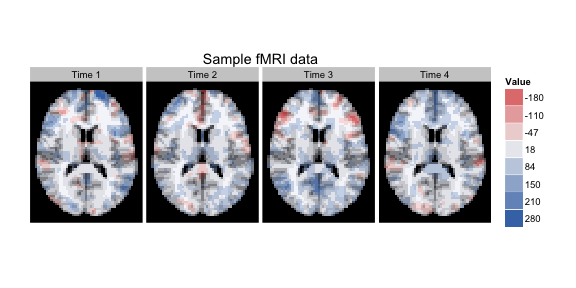 


We can also use the `brain_ind` argument to show seed correlation images from two different subjects. Changing the `mar` vector lets us to show different slices for each subject. Note, these correlation images are on the same scale.


```r
dd<-ggBrain(brains=list(s_map1,s_map2),
  brain_ind=c(1,1,1,2,2,2),
	template=template,
	mar=c(1,2,3,1,2,3),
	mar_ind=c(37,18,30,37,18,30),
	row_ind=c('Subject 1','Subject 1','Subject 1','Subject 2','Subject 2','Subject 2'),
	col_ind=factor(c(1,2,3,1,2,3),labels=c('Sagittal','Coronal','Transverse')),
	mask=mask)
dd + ggtitle('Seed correlations for two subjects') + theme_black_bg()
```

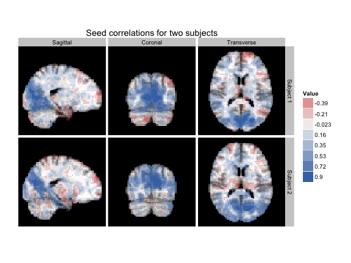 

The `lines_mat` argument can be used to add a key to multi-panel plots.  This argument should contain a matrix with 3 columns, and one row for each line to be added to the figure. Each row of `lines_mat` should contain a triplet of values, with the first element telling which panel the line should be placed in, the second element containing the margin to plot over, and the third element telling the slice index where the line should be placed.


```r
mar=c(3,3,3,3,3,3,3,1)
mar_ind=c(floor(seq(140,50,length=7)),88)
col_ind=c(1,1,1,1,2,2,2,2)
row_ind=c(1,2,3,4,1,2,3,4)
lines_mat<-cbind('panel'=8,mar,mar_ind)[1:7,]

lines_mat
```

```
##      panel mar mar_ind
## [1,]     8   3     140
## [2,]     8   3     125
## [3,]     8   3     110
## [4,]     8   3      95
## [5,]     8   3      80
## [6,]     8   3      65
## [7,]     8   3      50
```

```r
dd <- ggBrain(brains=hd_template, mar=mar, mar_ind=mar_ind,
              row_ind=row_ind, col_ind=col_ind, mask=hd_template>0,
              type='structural', lines_mat=lines_mat)

dd + theme_black_bg() + theme_all_blank()
```

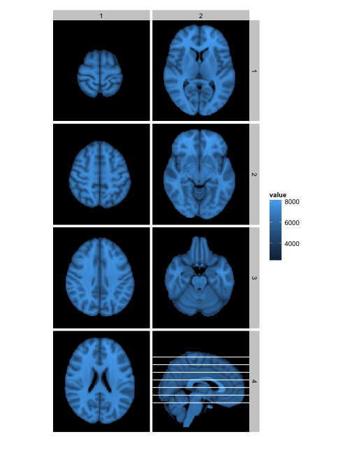 

These types of plots can also be created for voxelwise statistics


```r
mar_ind=c(floor(seq(48,20,length=7)),30) #reduce dimensions
# to match fMRI data
lines_mat<-cbind('panel'=8,mar,mar_ind)[1:7,]

dd <- ggBrain(brains=s_map1, template=template, mar=mar,mar_ind=mar_ind,
              row_ind=row_ind, col_ind=col_ind, mask=mask, lines_mat=lines_mat)

dd + theme_black_bg() + theme_all_blank()
```

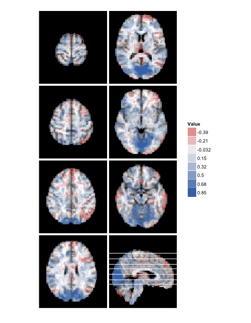 


###  <a name="tri-planar"> Tri-planar figures </a>

For a given voxel, a tri-planar figure shows the sagittal, coronal, and transverse slices that intersect that voxel. These three slices are shown in three panels, and cross-hairs are generated to show the spacial correspondence between the panels. 

In the example arrangement below, horizontal and vertical cross-hair lines are set up to continue across the panels.  Both horizontal cross-hair lines on the top two panels correspond to the same transverse slice, shown in the bottom panel. Both virtical cross-hairs on the leftmost panels correspond to the same sagittal slice, shown on the right.


```r
dd<-ggBrain(brains=s_map1,template=template,
  mar =		c(1,2,3),
	mar_ind =	c(37,18,30),
	row_ind=	c(1,1,2),
	col_ind=	c(2,1,1),
	tri_planar=TRUE, lines_color='black',mask=mask)
dd
```

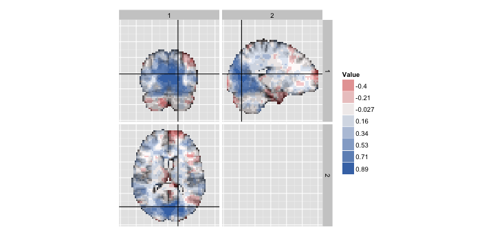 

In the next example, we show the seed mask and the seed correlation map from an example subject. Since the mask and the map are on different scales, we use `grid.arrange` to display them separately.


```r
mar   =   c(1,2,3)
col_ind = factor(c(1,2,3),labels=c('Sagittal','Coronal','Transverse'))
row_ind = c(1,1,1)
mar_ind=  c(37,18,30)

dd_mask<-ggBrain(brains=seed_mask,template=template,mar=mar,mar_ind=mar_ind,row_ind=row_ind,col_ind=col_ind,type='binary',binary_color='black',tri_planar=TRUE,mask=mask)+
	labs(alpha='Binary mask',title='Seed Mask')+theme_black_bg()


dd_1<-ggBrain(brains=s_map1,template=template,mar=mar,mar_ind=mar_ind,row_ind=row_ind,col_ind=col_ind,tri_planar=TRUE,mask=mask)+
	labs(title='Seed Correlation Map') + theme_black_bg()

library(gridExtra)
grid.arrange(dd_mask,dd_1)
```

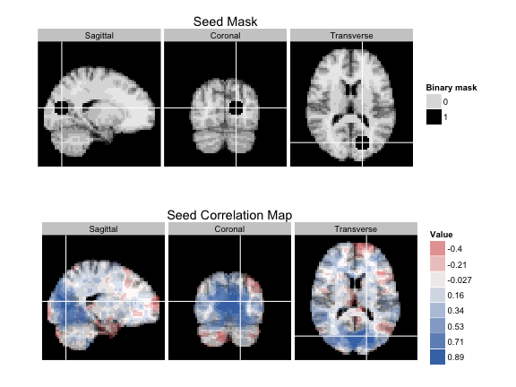 


